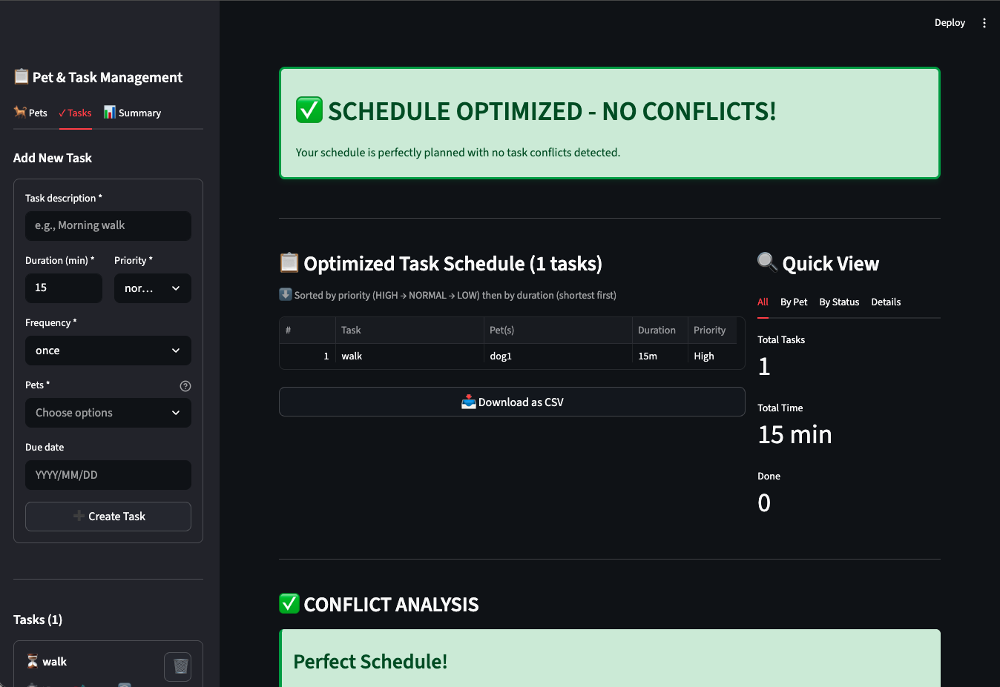

# PawPal+ (Module 2 Project)

You are building **PawPal+**, a Streamlit app that helps a pet owner plan care tasks for their pet.

## Scenario

A busy pet owner needs help staying consistent with pet care. They want an assistant that can:

- Track pet care tasks (walks, feeding, meds, enrichment, grooming, etc.)
- Consider constraints (time available, priority, owner preferences)
- Produce a daily plan and explain why it chose that plan

Your job is to design the system first (UML), then implement the logic in Python, then connect it to the Streamlit UI.

## What you will build

Your final app should:

- Let a user enter basic owner + pet info
- Let a user add/edit tasks (duration + priority at minimum)
- Generate a daily schedule/plan based on constraints and priorities
- Display the plan clearly (and ideally explain the reasoning)
- Include tests for the most important scheduling behaviors

## Getting started

### Setup

```bash
python -m venv .venv
source .venv/bin/activate  # Windows: .venv\Scripts\activate
pip install -r requirements.txt
```

### Suggested workflow

1. Read the scenario carefully and identify requirements and edge cases.
2. Draft a UML diagram (classes, attributes, methods, relationships).
3. Convert UML into Python class stubs (no logic yet).
4. Implement scheduling logic in small increments.
5. Add tests to verify key behaviors.
6. Connect your logic to the Streamlit UI in `app.py`.
7. Refine UML so it matches what you actually built.

### Smarter Scheduling

- Added tasks conflict handling logic
- Added the logic where a new Task instance will be added to the schedule if the Task is recurring and has completed.

### Testing PawPal+
- Command: python -m pytest tests/test_pawpal.py
- The tests cover cases scheduling recurring tasks, task conflicts, filtering scheduler, and sorting by priority or duration.
- The condidence level I had for the system's reliability based on the test results is about 4.


### Features
1. Priority-and-duration sorting: 
- Scheduler.generate_schedule() sorts Owner.get_all_tasks() with:
  - priority order HIGH > NORMAL > LOW
  - for equal priority, smaller duration first
- Supports stable ordering for equal priority+duration
2. Time-based conflict detection
- Scheduler.find_time_conflicts() groups schedule by due_date
- Detects:
  - same_pet conflict: tasks on same date with overlapping pet IDs
  - different_pets conflict: tasks on same date for different pets
- Scheduler.has_conflicts() returns boolean
- Scheduler.get_conflict_warning() creates human-readable warning string
3. Task add conflict guard
- Scheduler.add_task(task) rejects scheduling if:
  - due_date collision with same pet -> fail
  - due_date collision with different pet -> fail
  - duplicates handled idempotently
- Permits due_date=None as no-time conflict path
4. Recurrence/daily task chain
- Task.frequency via Frequency enum (ONCE, DAILY, WEEKLY, MONTHLY)
- Task.is_recurring() for non-ONCE
- Task.create_next_instance() returns next Task with:
  - +1 day for DAILY
  - +7 for WEEKLY
  - +30 for MONTHLY (approx)
- Task.mark_completed() sets completed and links next recurrence task back to pets
5. Pet-driven task graph
- Pet.tasks list keeps each pet’s tasks
- Pet.add_task() / remove_task() maintain relation
- Owner.get_all_tasks() aggregates tasks from all pets
6. Scheduler filtering
- Scheduler.filter_by_pet_name(pet_name) by assigned pet
- Scheduler.filter_by_completion(completed) by task done status
- Scheduler.get_tasks_by_pet() returns {pet_name: [Task]} mapping
7. Streamlit UI algorithm integration
- Sidebar forms: add pet/task, assign task to pet
- Schedule table and “generate schedule” uses underlying Scheduler methods
- Conflict banner and detailed “same/different pet” diagnostics
- Summary counters + CSV export
8. Regression-safe test coverage
- Tests for:
  - sorting by priority+duration, missing times
  - conflict branches (same/different/no due_date)
  - recurring task lifecycle (mark_completed → next instance)
  - filtering and full workflow with tasks/pets/scheduler


### Demo
<a href="demo.png" target="_blank"></a>.

